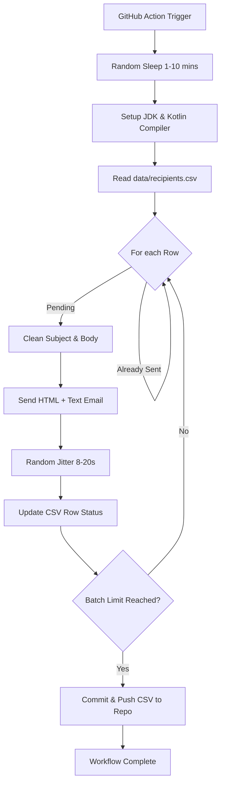

# Kotlin Outreach Engine

This repository is a Reusable Template for automated, high-fidelity email outreach. Optimized for Private Repositories, this engine balances high-volume delivery with strict anti-spam protections.

---

## How it Works
The engine uses Kotlin Scripting and GitHub Actions to automate personalized outreach. It follows a "Human-Mimicry" strategy to ensure high deliverability and protect your sender reputation.

### Key Optimizations:
1. **Deliverability Shield:** Uses Multi-part MIME (HTML + Plain Text fallback) and Anti-Injection logic to ensure emails land in the Primary Tab, not Spam.
2. **Human-Mimicry Jitter:**
    - **Variable Start:** The workflow waits a random 1-10 minutes before starting.
    - **Inter-Email Delay:** The script pauses for a random 8-20 seconds between every single email sent.
3. **Private Repo Optimized:** Uses direct binary downloads instead of heavy package managers to stay well within the 2,000-minute/month GitHub Actions free tier.
4. **Persistence:** Automatically updates your recipients.csv with "Sent at [Timestamp]" to prevent duplicate emails.

---

## Project Structure & Data Formatting

### 1. The Data Folder (/data)
To comply with privacy standards, your actual mailing list is ignored by Git via .gitignore.

- **recipients.sample.csv**: A public example of the required format.
- **recipients.csv**: (Create this file manually). Paste your leads here.

### CSV Column Structure:
| Name | Email | Status (Leave Empty) |
| :--- | :--- | :--- |
| John Doe | john@example.com | |

*The engine updates the 3rd column automatically upon success.*

---

## Setup Instructions

### 1. Repository Setup
1. Click "Use this template" and create a Private repository.
2. Create and upload your data/recipients.csv to your new repo.

### 2. GitHub Secrets (Crucial)
Go to Settings > Secrets and variables > Actions and add:
- GMAIL_USER: Your Gmail address.
- GMAIL_PASS: Your 16-character Google App Password.
- EMAIL_SUBJECT: Use {{Name}} for personalization (e.g., Invite for {{Name}} | AI Hackathon).
- EMAIL_BODY: Your full HTML template code.

### 3. Workflow Permissions
Go to Settings > Actions > General. Under Workflow permissions, select "Read and write permissions". This is required for the engine to save its progress back to the CSV.

### 4. Automation Schedule
By default, the engine wakes up every 8 hours to send a batch of emails. This ensures a steady, "non-bot" flow of traffic. You can manually trigger a run via the Actions tab at any time.

---

## Technical Flow
The following diagram illustrates how the engine processes your mailing list:

---

## Project Structure & Data Formatting

### 1. The Data Folder (`/data`)
Because of privacy (GDPR/Data Protection), the actual mailing list is **ignored by Git** via `.gitignore`.

- **`recipients.sample.csv`**: A public example of the required format.
- **`recipients.csv`**: **(Create this file manually)**. This is where you paste your 250+ leads.

### CSV Column Structure:
The script expects exactly three columns (Header row is required):

| Name | Email | Status (Leave Empty) |
| :--- | :--- | :--- |
| John Doe | john@example.com | |
| Jane Smith | jane@example.com | |

*Once sent, the engine updates the 3rd column to:* `Sent at 2026-03-26T14:30:00`

### 2. The Engine (`outreach.main.kts`)
A standalone Kotlin script that handles:
- **SMTP SSL/TLS Connection** via Port 465.
- **HTML Content Rendering** for professional-looking "Card" layouts.
- **Batch Limiting** to stay within Gmail's safety limits.

---

## Setup Instructions (The "Coordinator" Workflow)

### 1. Repository Setup
1. Click **"Use this template"** and create a **Private** repository.
2. Upload your `data/recipients.csv` to your new private repo.

### 2. Security (GitHub Secrets)
Go to **Settings > Secrets and variables > Actions** and add:
- `GMAIL_USER`: Your Gmail address.
- `GMAIL_PASS`: Your 16-character **Google App Password**.
- `EMAIL_SUBJECT`: `Exciting News for {{Name}}! AI Mobile Hackathon 2026`
- `EMAIL_BODY`: Your full HTML template code.

### 3. Permissions
Go to **Settings > Actions > General**. Under **Workflow permissions**, select **"Read and write permissions"**. This allows the script to update your CSV file after sending emails.

### 4. Automation
The script is set to run every 6 hours via `.github/workflows/outreach.yml`. You can also trigger it manually by going to the **Actions** tab and clicking **"Run workflow"**.

---

## Let's Connect
As the Coordinator for this event, I'm always looking to connect with mobile developers and AI enthusiasts.

- **Portfolio:** [kaustubhdeshpande.tech](http://kaustubhdeshpande.tech/)
- **LinkedIn:** [deshkaustubh](https://www.linkedin.com/in/deshkaustubh/)
- **GitHub:** [deshkaustubh](https://github.com/deshkaustubh)

---
*Disclaimer: Use this tool responsibly. Ensure all recipients have opted-in to receive communications in accordance with local anti-spam laws.*